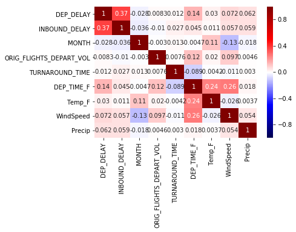
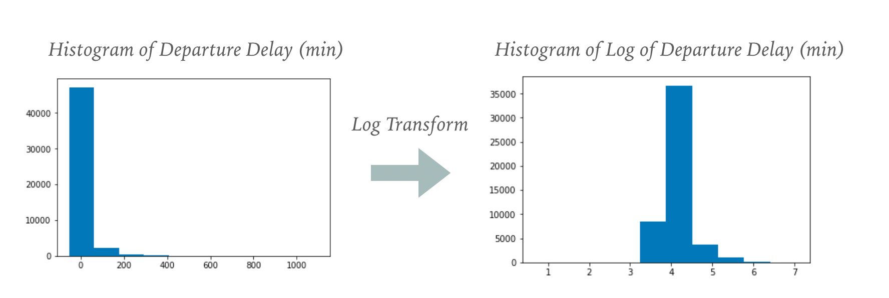

# Project-02

## Overview
Delayed aircraft are estimated to have cost the airlines several billion dollars in additional expense [1]. Not to mention the uncertainty it adds to a passenger's travels. The goals of this project is to  predict flight delay time using linear regression based on 2017 United States flights data. Through the analysis, it should also shine a light on factors that impacts flight delay time, and help others develop mitigating strategies.

## Data Sources
* 2017 Flight delay and cancellation data from [Bureau of Transportation Statistics](https://www.transtats.bts.gov/DL_SelectFields.asp?Table_ID=236)
* 2015 airport volume data scraped from Bureau of Transportation Statistics website: [Bureau of Transportation Statistics](https://www.transtats.bts.gov/airports.asp?pn=1)
* Historic airport weather data from Iowa State University website: [Iowa State Univerity Mesonet](https://mesonet.agron.iastate.edu/request/download.phtml?network=WA_ASOS)

## Methodology Used
1. From the [bts.gov](https://www.transtats.bts.gov) site:
    * CSVs of 2017 Flight delay and cancellation data is downloaded
    * Airport volume data is scrapped using [beautifulsoup](https://pypi.org/project/beautifulsoup4/) [code here](Web_scraping_airport_volume.ipynb)
2. From [Iowa State Univerity Mesonet](https://mesonet.agron.iastate.edu/request/download.phtml?network=WA_ASOS):
    * CSVs of 2017 weather data is first obtained through python script [(code here)](Get_weather_data.py)
    * Weather data is then further sampled into 3-hour intervals for easy merging with airport data [(code here)](Agg_and_clean_airport_weather.ipynb)
3. Airport volume data, weather data, and flights data are then merged for modeling. It is then further cleaned by dropping rows without weather data. [(code here)](Data_acq_and_cleaning.ipynb)
4. Data set is randomly sampled to 50,000 rows for modeling. Cross-validation with 5 folds is used on 80% of the data set to select features and model parameters. [(code here)](Model_training_and_test.ipynb)
5. Features selection:
    * Initially the following features were considered: 'Inbound Delay', 'Month', 'Airport Departure Volume', 'Plane Turnaround Time','Departure Time','Temperature', 'Wind Speed','Precipitation'
    * Features are checked using correlation matrix !

  

    * Then some features get can zero-ed out in Lasso regressions and are removed, specifically: 'Month', 'Airport Departure Volume', 'Plane Turnaround Time', 'Temperature'
    * ''Wind Speed' is further eliminated due to causing lower R2 score (indicating overfitting)
    * So three features remains to be used in model: 'Inbound Delay', 'Departure Time', 'Precipitation'
6. No feature transform were needed when checking the residual plots, but y (Departure Delay) is noticed to be heavily left skewed and so is being log transformed before training.

  

7. RidgeCV, LassoCV, ElasticNet Models were used in training, and RidgeCV was seen to have slightly better R2 scoring, and therefore chosen.

## Results
* Ridge linear regression yielded a relatively low R2 score: 0.234
* Out of the 3 features used, "Inbound delay" has the best predictive power (coefficient=0.145), compared with "Departure Time (coefficient=0.068), and "Precipitation" (coefficient=0.016)
* See Jupyter notebook for steps to get to results [(code here)](Model training and test.ipynb)

## Conclusions
* Three factors 'inbound delay', "departure time", "precipitation" are factors in departure delay, but are insufficient to reliably predict departure delay Time
* Further predictive features should be explored, for example:
    * Around airport volume or airport "busy-ness" should be explored, for example:
      * Timeframes around public holidays
      * Hourly volume of an airport around flight departure time
    * Airline carrier

## References
1. Airlines for America. http://airlines.org/dataset/per-minute-cost-of-delays-to-u-s-airlines/
